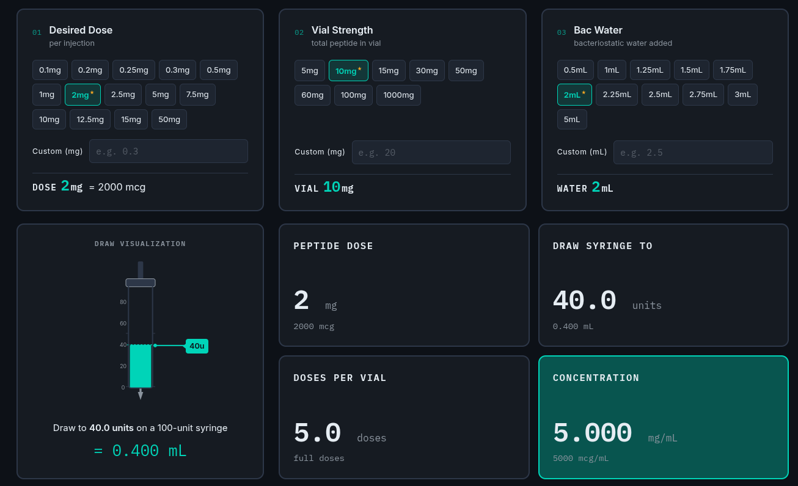

# PeptideCalc

## Purpose

PeptideCalc is a **Reconstitution & Dosage Calculator** designed to help calculate precise dosing for peptide reconstitution. It provides an intuitive interface to determine the correct amount of bacteriostatic water to add to a vial and calculate accurate injection doses based on desired peptide strength and vial concentration.

The calculator includes preset values for common peptides and supports custom inputs for advanced users, with real-time validation and visual indicators for proper dosing ranges.
